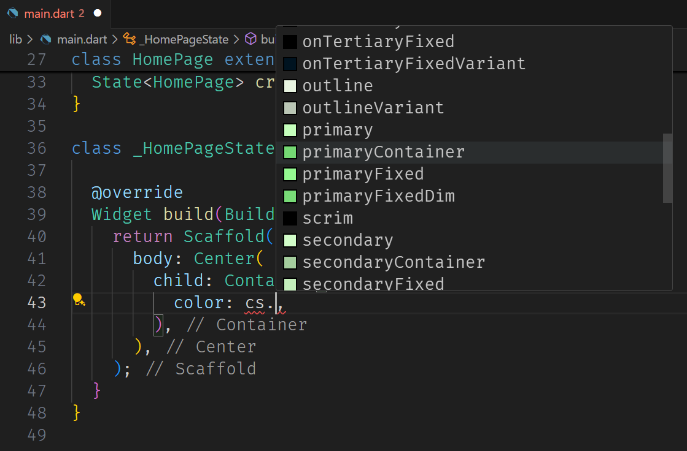

# Flutter Color Scheme Snippet (M3)

## Features

* Provides a snippet to visualize the colors generated by your Material Design 3 theme at development time.

## Requirements

* Flutter/Dart extension;
* Opened dart/flutter project;
* Provide configuration to generate color scheme in development time.


# INSTRUCTIONS
## 1. Setup
1. Install the extension;
2. Have a flutter project open;
3. Go to the settings section of your theme:
```dart
class FCSExampleApp extends StatelessWidget {
  const FCSExampleApp({super.key});

  @override
  Widget build(BuildContext context) {
    return MaterialApp(
      title: 'FCS Example',
      theme: ThemeData(
        colorScheme: ColorScheme.fromSeed(
          seedColor: Colors.deepPurple, // <- Note this
          brightness: Brightness.dark, // <- Note this
          dynamicSchemeVariant: DynamicSchemeVariant.tonalSpot, // <- Note this
          contrastLevel: 1 // <- Note this
          ),
      ),
      home: const HomePage(),
    );
  }
}
```
4. Press F1 to open the command pallet;
5. Run "FCS Set All" command;
6. You will need to set the seedColor, brightness, dynamicSchemeVariant and contrastLevel;
7. Ready!

You don't need to define all four variables, if you want you can define them separately using the commands:
* FCS Set Seed Color;
* FCS Set Brightness;
* FCS Set Dynamic Scheme Variant;
* FCS Set Contrast Level;

## 2. Usage

To use the snippet is very simple, you just need to activate it wherever you want using the "__cs.__" shortcut that means color scheme.
For example imagine that you want to add a color to a Container:
``` dart
child: Container(
    color: ,
),
```
Just type __cs.__ and the snippet will pop up showing all the colorScheme variables and a color box showing the relative color:
``` dart
child: Container(
    color: cs.,
),
```


After you select a color the __cs.__ will be replaced with the correct reference:

``` dart
child: Container(
    color: Theme.of(context).colorScheme.primaryContainer,
),
```

## For more information


**Enjoy!**
